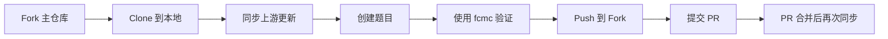

# xxxx FloatCTF xxx题目仓库

<challenges>

</challenges>

**相关链接**：

- 主仓库：https://github.com/FloatCTF/challenges-xxxxxxxx-xxxxx
- 题目模板：https://github.com/FloatCTF/challenge-template
- 平台地址：http://127.0.0.1:9090 （本地测试）

## 快速开始

### 协作流程



1. **Fork 仓库**: 访问 [主仓库](https://github.com/FloatCTF/challenges-202510-freshcup) 点击 Fork
2. **克隆并设置上游**:

   ```bash
   # 克隆你的 Fork
   git clone https://github.com/[你的用户名]/challenges-202510-freshcup.git
   cd challenges-202510-freshcup

   # 设置上游仓库（重要！）
   git remote add upstream https://github.com/FloatCTF/challenges-202510-freshcup.git
   ```
3. **同步最新代码**（每次开始前）:

   ```bash
   git fetch upstream
   git merge upstream/main
   git push origin main
   ```
4. **创建题目**: 在对应类别目录下添加题目
5. **验证并提交**:

   ```bash
   fcmc check  # 验证题目配置
   git add .
   git commit -m "feat: add [category]/[challenge_name]"
   git push origin main
   ```
6. **提交 PR**: 在 GitHub 上创建 Pull Request

### 本地测试

#### 使用 fcmc 工具验证题目

[fcmc](https://github.com/FloatCTF/fcmc) 是 FloatCTF 官方提供的题目配置检查和管理工具。

##### 安装 fcmc

```bash
# 使用 cargo 安装（需要先安装 Rust）
cargo install fcmc
```

````

##### 检查题目配置

```bash
# 检查所有题目配置文件是否符合规范
fcmc check
````

##### 生成新的题目模板

```bash
# 生成新题目的标准模板
fcmc gen
```

##### fcmc 命令说明

| 命令      | 说明                          | 用法示例                    |
| --------- | ----------------------------- | --------------------------- |
| `check` | 检查题目配置并自动测试 Docker | `fcmc check` (在题目目录) |
| `gen`   | 生成新的题目模板              | `fcmc gen -n test`        |
| `help`  | 显示帮助信息                  | `fcmc help`               |

#### 导入到平台

```bash
# 确保平台在 http://127.0.0.1:9090 运行
python import_challenges.py
```

## 使用 fcmc 快速出题

### 完整工作流程示例

```bash
# 1. 安装 fcmc
cargo install fcmc

# 2. 生成新题目模板
fcmc gen -n sql_injection
# Created Web/sql_injection/meta.toml
# Created Web/sql_injection/attachment/
# Created Web/sql_injection/src/

# 3. 编辑题目配置
cd Web/sql_injection
# 编辑 meta.toml, 添加题目内容

# 4. 验证题目配置（在题目目录下）
cd Web/sql_injection
fcmc check
# 如果是 Docker 题目，fcmc 会：
# 1. 自动构建 Docker 镜像
# 2. 启动容器并提供访问地址
# 3. 等待你测试完成后清理容器

# 5. 测试 Docker 题目（如适用）
cd Web/sql_injection/src
docker build -t sql_injection .
docker run -p 8080:80 -e FLAG="flag{test}" sql_injection

# 6. 提交代码
git add .
git commit -m "feat: add Web/sql_injection"
git push origin main
```

## 出题指南

### 题目目录结构

每个题目必须遵循以下目录结构：

```
[类别]/[题目名]/
├── meta.toml           # 必须：题目配置文件
├── attachment/         # 可选：附件目录
│   └── files...
└── src/                # 可选：Docker 源码（动态题目）
    ├── Dockerfile
    ├── flag.sh
    └── ...
```

**支持的题目类别**：

- `Web` - Web 安全
- `Crypto` - 密码学
- `Misc` - 杂项
- `Pwn` - 二进制漏洞
- `Reverse` - 逆向工程

### meta.toml 配置说明

#### 基本配置（必填）

| 字段            | 类型   | 说明                       | 示例                                                      |
| --------------- | ------ | -------------------------- | --------------------------------------------------------- |
| `name`        | String | 题目名称（与文件夹名一致） | `"web_shell"`                                           |
| `author`      | String | 作者邮箱                   | `"admin@ctf.com"`                                       |
| `category`    | String | 题目类别                   | `"Web"`/`"Crypto"`/`"Misc"`/`"Pwn"`/`"Reverse"` |
| `description` | String | 题目描述                   | `"这是一个 SQL 注入题目"`                               |
| `attachment`  | String | 附件路径（可选）           | `"attachment/source.zip"`                               |

#### [flag] 配置段（必填）

| 字段        | 类型   | 说明                      | 示例                       |
| ----------- | ------ | ------------------------- | -------------------------- |
| `value`   | String | Flag 值（空串=动态 flag） | `"flag{test}"` 或 `""` |
| `env_var` | String | 环境变量名                | `"FLAG"`                 |

#### [docker] 配置段（动态题目必填）

| 字段          | 类型   | 说明            | 示例                           |
| ------------- | ------ | --------------- | ------------------------------ |
| `image_tag` | String | Docker 镜像标签 | `"web_shell:latest"`         |
| `port`      | String | 端口/协议       | `"80/tcp"` 或 `"1337/tcp"` |

### 完整示例

#### 示例 1：静态 Flag 题目

```toml
# Crypto/base64/meta.toml
name = "base64"
author = "admin@ctf.com"
category = "Crypto"
description = "ZmxhZ3tiYXNlNjRfaXNfZnVufQ=="
points = 100.0 # for event

[flag]
value = "flag{base64_is_fun}"
env_var = "FLAG"
```

#### 示例 2：带附件的题目

```toml
# Misc/stego/meta.toml
name = "stego"
author = "admin@ctf.com"
category = "Misc"
description = "图片里面藏着秘密"
points = 100.0 # for event

attachment = "attachment/secret.png"

[flag]
value = "flag{hidden_in_image}"
env_var = "FLAG"
```

#### 示例 3：Docker 动态题目

```toml
# Web/sqli/meta.toml
name = "sqli"
author = "admin@ctf.com"
category = "Web"
description = "简单的 SQL 注入"
points = 100.0 # for event

[flag]
value = ""  # 动态 flag
env_var = "FLAG"

[docker]
image_tag = "sqli:latest"
port = "80/tcp"
```

**Dockerfile 示例**：

```dockerfile
FROM php:5-apache
COPY index.php /var/www/html/
# flag替换脚本 固定， 剔除\r
COPY flag.sh /flag.sh
RUN [ -f /flag.sh ] && tr -d '\r' < /flag.sh | tee /flag.sh >/dev/null && chmod +x /flag.sh
# flag replacer script end
# 在容器启动时执行 flag 替换，然后启动 nginx
CMD ["/bin/sh", "-c", "/flag.sh && nginx -g 'daemon off;'"]
```

**flag.sh 示例**：

```bash
#!/bin/bash
# 动态替换 flag
sed -i "s/flag{test_flag}/$FLAG/" /var/www/html/index.php
# 清理环境变量
export FLAG=not_flag
rm -f /flag.sh
```

### 出题最佳实践

#### DO - 正确做法

- 文件夹名与 `meta.toml` 中的 `name` 保持一致
- 使用小写字母和下划线命名：`web_shell`、`rsa_attack`
- Flag 格式统一：`flag{xxx-xxx-xxx}`
- 动态题目使用 `flag.sh` 替换 flag
- 附件压缩后放在 `attachment/` 目录
- Docker 题目本地测试通过后再提交

#### DON'T - 错误做法

- 在 Dockerfile 中硬编码 flag
- 使用空格或特殊符号命名
- 附件超过 50MB
- 忘记清理环境变量中的 flag
- 提交未测试的代码

### 测试和验证

#### 使用 fcmc 自动验证

**fcmc check 功能特性：**

- 解析并验证 meta.toml 配置
- 检查附件是否存在
- 自动构建并启动 Docker 容器
- 提供访问地址进行手动测试
- 测试完成后自动清理容器

```bash
# 在题目目录下执行
cd Web/robots
fcmc check
```

**实际输出示例：**

```
================ 配置检查报告 ================

配置文件: ".\meta.toml"

[解析结果]
  OK   配置文件解析成功

[附件检查]
  WARN   未配置附件

[Docker 检查]
  OK 已启动容器: robots_local_test
  INFO 访问地址: http://localhost:45087
  INFO 按回车键继续以清理容器...
  OK 已清理容器: robots_local_test

----------------------------------------------
最终结果: 通过
==============================================
```

**提示**：当 Docker 检查启动后，你可以：

1. 打开浏览器访问提供的地址
2. 按照解题步骤测试题目
3. 测试完成后按回车清理容器

#### Docker 题目本地测试

```bash
# 构建镜像
cd Web/your_challenge/src
docker build -t test .

# 运行测试
docker run -p 8080:80 -e FLAG="flag{test}" test

# 访问测试
curl http://localhost:8080
```

#### 检查清单

- [ ] 使用 `fcmc check` 验证通过
- [ ] 目录结构正确
- [ ] meta.toml 格式正确
- [ ] 类别正确（Web/Crypto/Misc/Pwn/Reverse）
- [ ] Docker 题目可正常运行（如适用）
- [ ] 附件可正常访问（如适用）
- [ ] 本地导入测试通过

## 常见问题

### 题目开发 FAQ

**Q: 支持多个附件吗？**
A: 仅支持一个附件，多文件请打包成 zip。

**Q: 已有 Docker 镜像怎么办？**
A: 保持目录结构，在 meta.toml 中指定正确的 image_tag 即可。

**Q: 如何修改已导入的题目？**
A: 直接修改后重新运行 `import_challenges.py`，会自动覆盖。

### 保持仓库同步指南

#### 初次设置上游仓库（只需执行一次）

```bash
# 1. 添加上游仓库
git remote add upstream https://github.com/FloatCTF/challenges-202510-freshcup.git

# 2. 验证远程仓库设置
git remote -v
# 应该看到：
# origin    https://github.com/[你的用户名]/challenges-202510-freshcup.git (fetch)
# origin    https://github.com/[你的用户名]/challenges-202510-freshcup.git (push)
# upstream  https://github.com/FloatCTF/challenges-202510-freshcup.git (fetch)
# upstream  https://github.com/FloatCTF/challenges-202510-freshcup.git (push)
```

#### 同步上游更新（每次需要更新时执行）

```bash
# 方法一：推荐方式 - 保留提交历史
# 1. 获取上游仓库的最新更改
git fetch upstream

# 2. 切换到主分支
git checkout main

# 3. 合并上游更改
git merge upstream/main

# 4. 推送到你的 Fork
git push origin main
```

```bash
# 方法二：强制同步 - 放弃本地更改
# 警告：这会丢失你的本地未提交更改
git fetch upstream
git checkout main
git reset --hard upstream/main
git push origin main --force
```

#### 处理合并冲突

如果在合并时遇到冲突：

```bash
# 1. 查看冲突文件
git status

# 2. 手动编辑冲突文件，解决冲突
# 查找 <<<<<<< 、======= 、>>>>>>> 标记

# 3. 标记冲突已解决
git add [解决冲突的文件]

# 4. 完成合并
git commit -m "merge: sync with upstream"

# 5. 推送更改
git push origin main
```

#### 完整同步工作流示例

```bash
# 场景：其他人的 PR 已合并，你需要同步最新题目

# 1. 保存当前工作（如果有未提交的更改）
git stash

# 2. 同步上游
git fetch upstream
git checkout main
git merge upstream/main

# 3. 更新你的 Fork
git push origin main

# 4. 恢复之前的工作（如果有）
git stash pop

# 5. 验证新题目
fcmc check
```

#### 最佳实践

1. **定期同步**：在开始新题目前，先同步上游更新
2. **创建分支**：为每个新题目创建独立分支
   ```bash
   git checkout -b feat/my-new-challenge
   ```
3. **及时合并**：PR 被合并后，立即同步主仓库
4. **使用 fcmc 验证**：同步后运行 `fcmc check` 确保所有题目正常

### Git 协作 FAQ

**Q: 如何快速同步上游更新？**

```bash
# 一行命令完成同步（无冲突情况）
git pull upstream main && git push origin main
```

````

**Q: PR 模板？**

```markdown
## 题目信息
- 名称：[challenge_name]
- 类别：[Web/Crypto/Misc/Pwn/Reverse]
- 难度：[简单/中等/困难]
- 考察点：[简要描述]

## 检查清单
- [ ] meta.toml 格式正确
- [ ] 本地测试通过
- [ ] Docker 可正常运行（如适用）
````

**Q: 多人合作出题？**
A: 主要负责人 Fork → 添加 collaborators → 共同开发 → 统一提交 PR。
